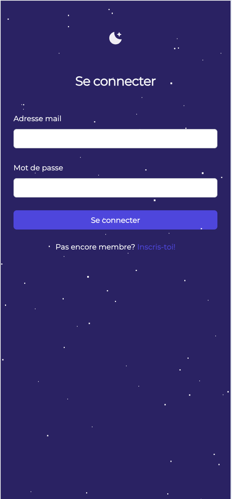
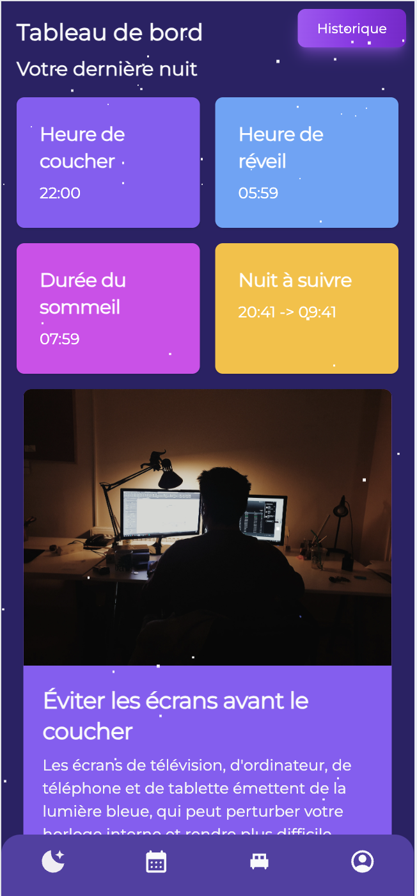
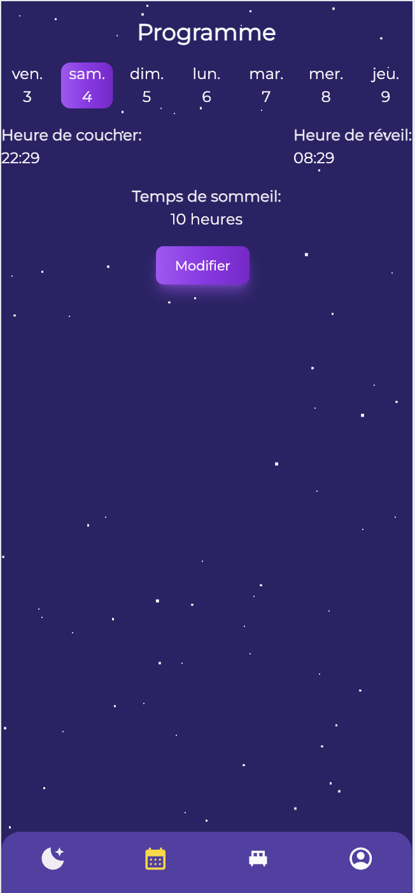
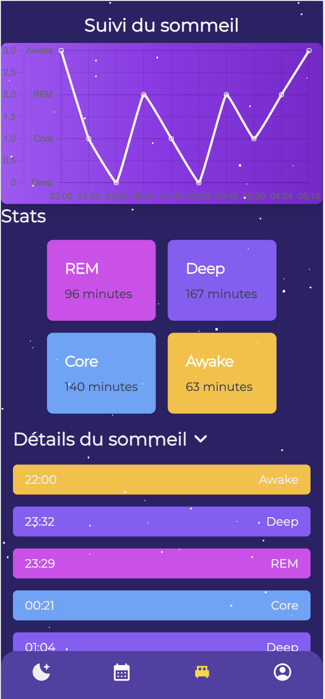
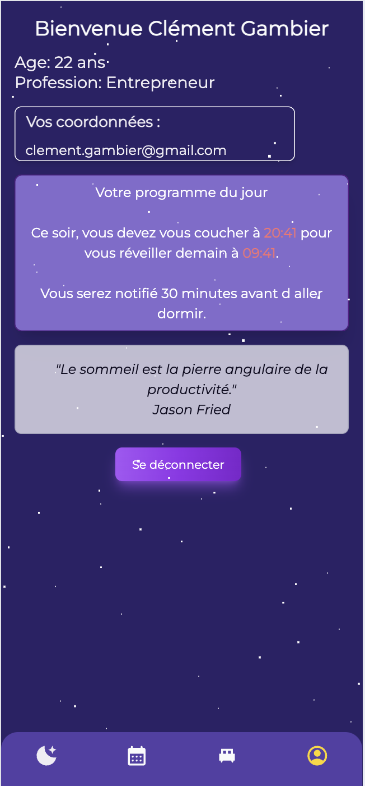

# 💤 Somnum - Reprenez le controle sur votre sommeil 🛏️

Clément Gambier | Liès Tiguercha | Theo Perus

Realisé dans le cadre de notre cours de web à l'ISEN Lille.

[Url de déploiement](https://icy-plant-0cc512103.5.azurestaticapps.net/)

## 📖 Description

Somnum est une application de sommeil construite avec React, Tailwind, Jotai et Supabase, et build avec Vite. Elle permet de suivre vos habitudes de sommeil et de vous aider à améliorer votre sommeil.

## 🛠️ Technologies utilisées

- React
- Tailwind
- Jotai
- Supabase
- Vite
- Azure

## 📸 Captures d'écran

### Page de login

### Tableau de bord

### Page de programme

### Page de nuit

### Page de profil

